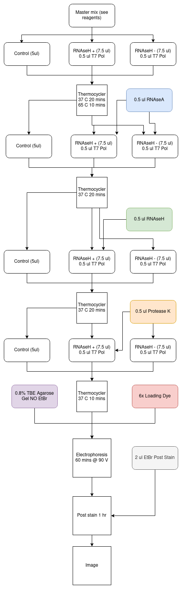

# IVT Plasmid pFC8 T1 T2 2

## Summary

Redoing the IVT assay with different batch of the plasmid.

## Reagents

| Name | Volume (ul) | 
| ---- | ----------- |
| 5x Buffer | 4 |
| 100 mM DTT | 4 |
2.5 mM NTP | 1 |
DNA | 4 |
H20 | 11 |

## Protocol Flow

Note: When using more plasmids do not split
the RNAse + and - cases until after the polymerase
is added. Can keep these in one tube until then.

## Results