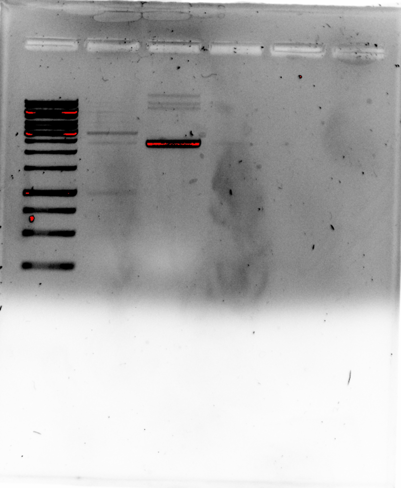
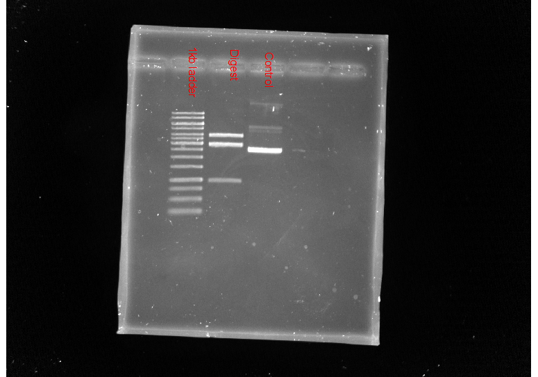

# pFC8 T1 T2 2 Digest with HindIII and KpnI 

## General

Restriction enzymes are kept in the large white fridge
on the second shelf in the door. 

In order to determine what buffer to use with each enzyme
check the New England Biolabs chart on the door. If using more
than one enzyme pick the buffer that will provide the
best overall activity for both.

The equivalent chart is available at [this link](https://www.neb.com/products/~/media/3dd6af7e75dc4106a93bb022efab9789.ashx).

## Reagents

| Reagent Name | Volume Control (ul) | Volume Digest (ul) |
| ------------ | ------ | --------------------  |
| DNA | 1 | 1 |
| 10x buffer | 2 | 2 |
| KpnI | 0 | 0.5 |
| HindIII | 0 | 0.5 |
H2O | 17 | 16 |

Make sure to use nano-pure autoclave water not just the nano-pure water
from the machine. Not using the sterilized water can cause contamination. This is true for pretty much all experiments.

### Not gel stuff

Plasmid concentration measured at 260 ng / ul. Generally will want
around 200 ng of DNA per lane which is why could use 1 ul in
this case.

### Gel stuff

40 ml 0.9 % agarose gel. Generally for gels % will refer to
grams per 100 ml. So the 40 ml gel at 0.9 % = 0.36 g of agarose. 

## Protocol notes and tips

- Since we are not concerned about R-loop formation in this test
  the ethedium bromide can be added directly into the molten
  agarose when making the gel. 
- when making the gel can also use water or leftover nice to cool the
  agarose faster. If you are going to do this make sure to swirl things around in the flask to prevent part of the gel setting too
  quickly.
- Make sure to add ethedium bromide *to* to the agarose *before* it
  sets. Otherwise add additional time to post stain it when this is
  not needed.

## Results

| Lane (from left) | Treatment |
|------|-----------|
|  1    |   100 bp ladder|
|2 | Digested |
|3 | Control |

## Restriction digest part II: electric boogaloo

The digest signal was pretty weak so I redid the protocol.
The only difference being that used post-stain instead of
adding EtBr directly to gel.

Fred also notes that if you do not do a post-stain then you
should add EtBr to the buffer as well when running the gel which
I did not do in the first gel.

