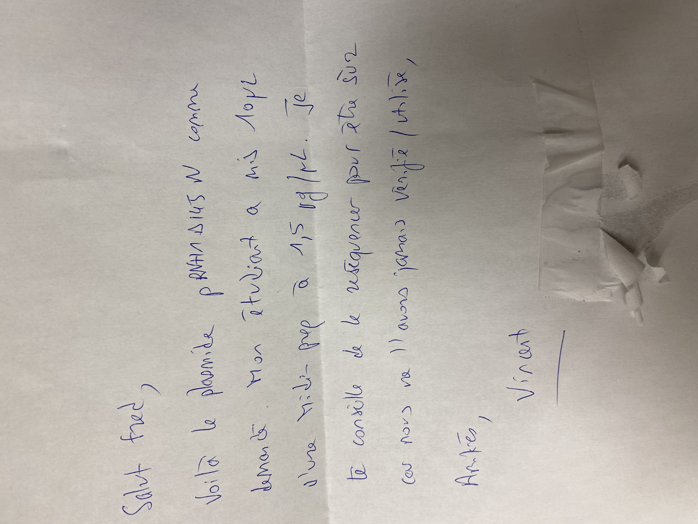
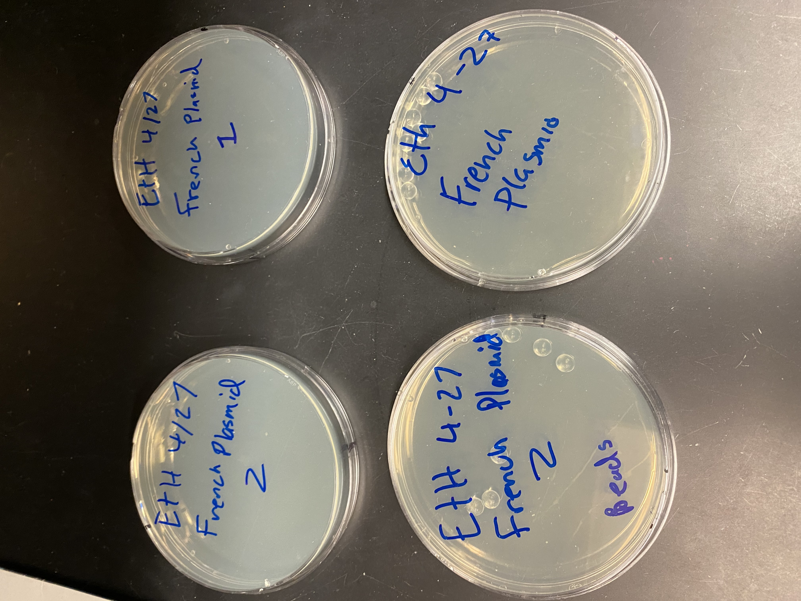

# Starting transformation of French plasmid

Fred received plasmid pRNHdeltaD145 N and
now transforming into E. coli.

## General tips

- Timing when removing the cells is very important
  when protocol says incubate for 5 mins on ice
  it means it.
- Cells are sensitive to bubbles and temp changes
  so minimize both to max degree
- Aim for 10 ng of DNA
- Cells are stored in second to top drawer of the -80 freezer

## Protocol Notes

E. coli were transformed in two main batches, first
one so I could watch Rachel and second one did
myself. Normally should do them all at once to avoid
leaving the cells on ice for too long.

Note that came with the plasmid.

Plates incubating on bench, moved to 37 C at 2 pm.

