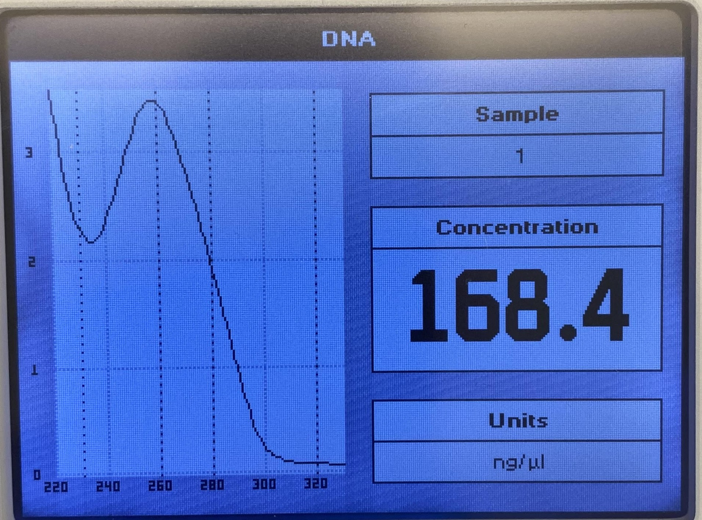
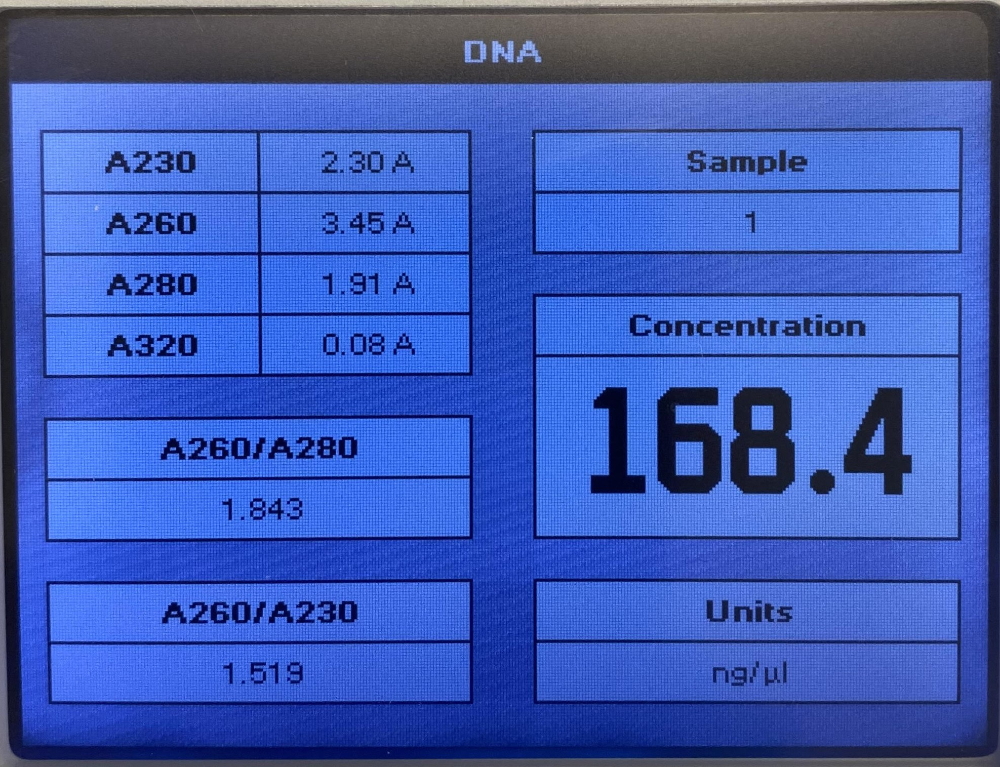

# MIDI Prep

Pulled bacteria off the shakers around 8:30 am. Started MIDI prep protocol with Rachel around 9. Only the 1000 ml flask had any growth.
Not sure what happened with the bacteria in the 2000 ml flask.

## Protocol notes

- Make sure have all buffers before starting
    - Buffer 1 lasts while as long as don't add RNaseA
- Always check to make sure centrifuge caps are on
- The hex key for the big centrifuge is located on its side. You need 
   to hold down the cover when tightening.

## Results 

DNA extraction was successful. Stored in freezer box `Ethan` nanodrop
results below. DNA concentration ~170 ng/ul.

## Notes of ratios and interpretation 

From this [document](http://www.u.arizona.edu/~gwatts/azcc/InterpretingSpec.pdf)

The A260 / A230 is outside of the general range of above 1.8 which
indicates that there is contamination by organic compounds which
could interfere with downstream protocols. 