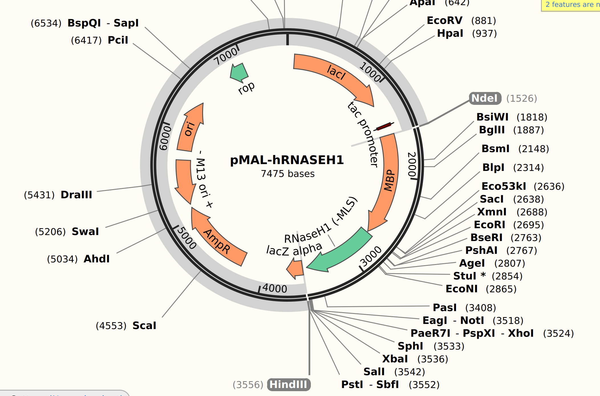
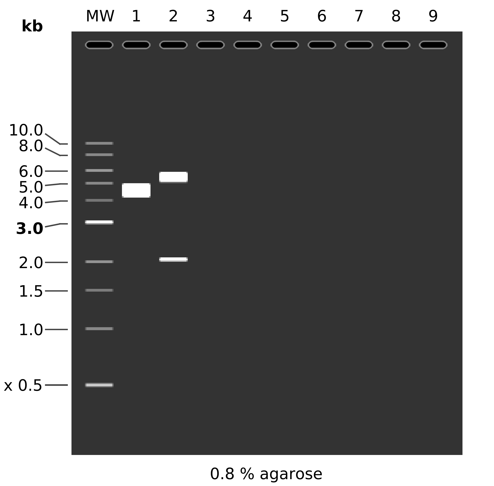
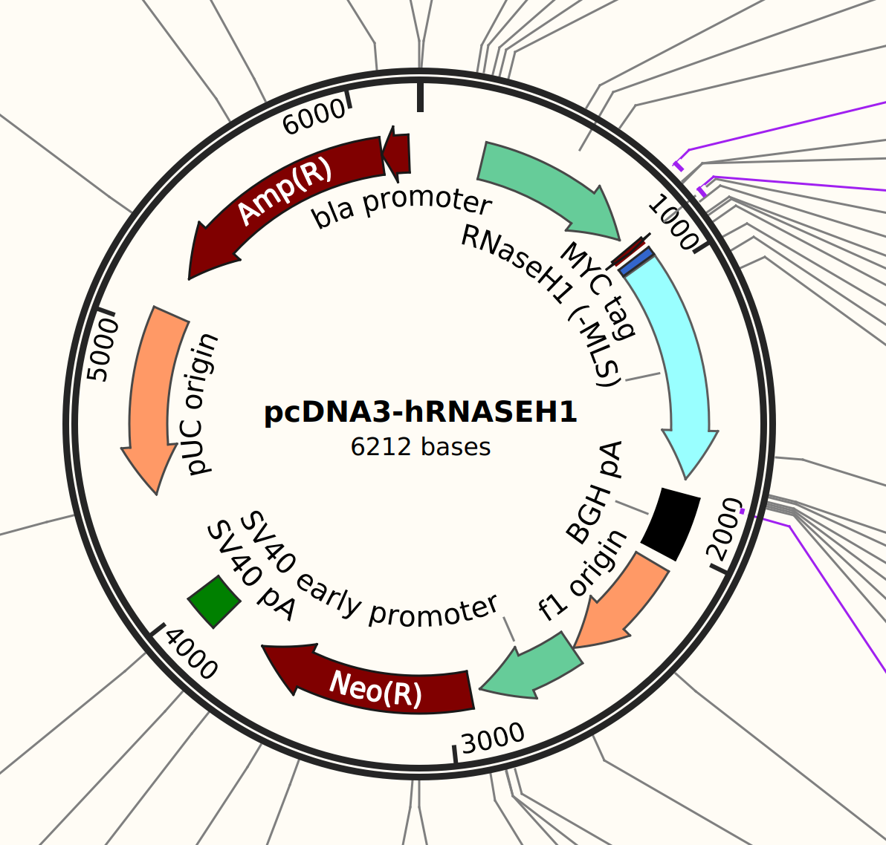
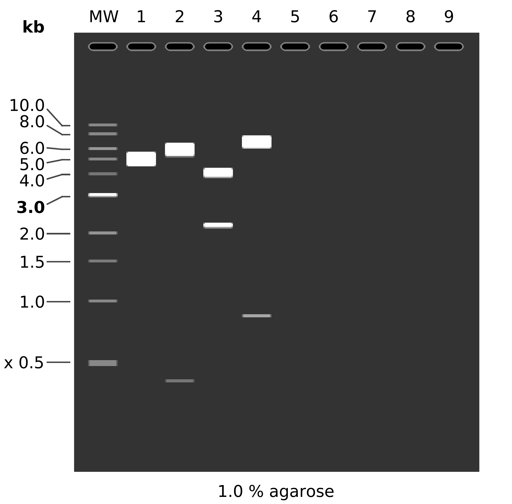

# Restriction digest

Digesting pMAL plasmid with `HindIII` and `NdeI`.

## Plasmid features



## Simulated digest

Lane 1 is control, lane 2 is digested.



## Protocol

| Reagent Name | Volume Control (ul) | Volume Digest (ul) |
| ------------ | ------ | --------------------  |
| DNA | 1.17 | 1.17 |
| 10x buffer | 2 | 2 |
| RdeI | 0 | 0.5 |
| HindIII | 0 | 0.5 |
H2O | 16.83 | 15.83 |

Incubate at 37C for 1 hour.

Run on 0.8 % agarose gel with EtBr.

## Results


Bands at 6kb and 500 kb which is not what is expected here.

This is because don't actually think it is `pMal-hRNASEH1`, it seems to actually be `pcDNA3-hRH1` which is shown below. 



Using this digest these would be the expected bands.


Fragment list, and simulated digest, 2nd lane is simulated using above digest, 3rd is with EcoR1 and PstI, 4th lane is what the digest would look like if the plasmid was in fact pMAl with a
EcoR1 PstI digest.




```
MW:  1 kb DNA Ladder

1:  pMAL RH1
       1. 7475 bp

2:  pcDNA3-hRH1
    HindIII + NdeI
       1. 5807 bp
       2. 405 bp

3:  pcDNA3-hRH1
    EcoRI + PstI
       1. 4045 bp
       2. 2167 bp

4:  pMAL RH1
    EcoRI + PstI
       1. 6618 bp
       2. 857 bp
```

