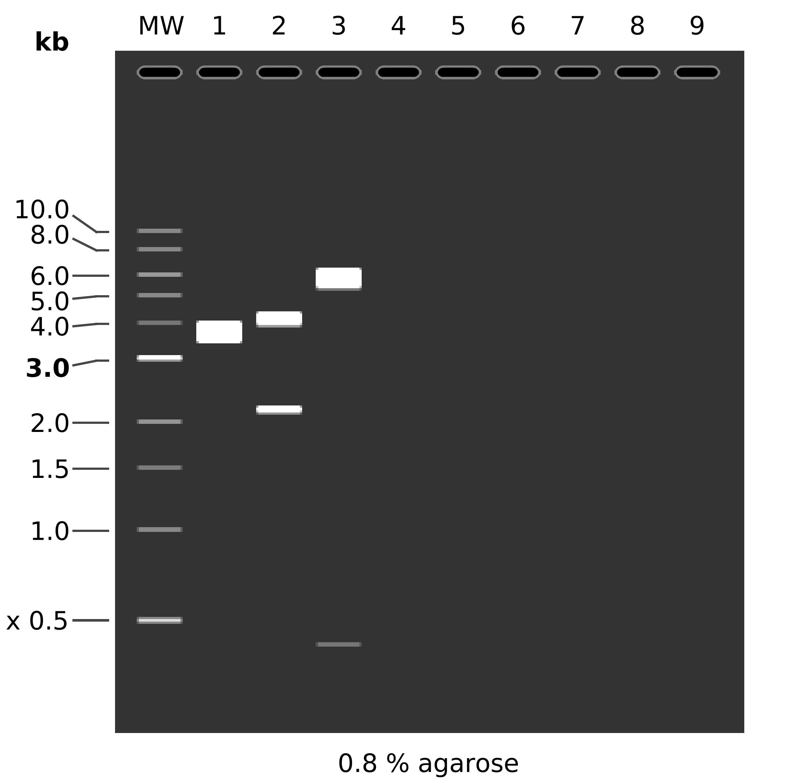

# Restriction digest part II

After digest on Friday indicated that the plasmid we thought
was `pMal-hRNASEH1` actually seems to be `pcDNA3-hRH1` doing a follow up
digest to confirm that.

## Protocol

All units are in micro liters.

| Reagent Name | Control | Digest 1 | Digest 2 |
| ------------ | ------ | --------------------  | -------- |
| DNA | 1.17 | 1.17 | 1.17 | 1.17 |
| 10x 2.1 buffer | 2 | 2 | 2 | 2 |
| NdeI | 0 | 0.5 | 0 |
| HindIII | 0 | 0.5 | 0 |
| EcoRI  | 0  | 0 | 0.5 |
| RstI   | 0  | 0 | 0.5
H2O | 16.83 | 15.83 | 15.83 |

Incubate all samples 1 hr at 37 C. Run on 0.8 % gel for 1 hr at 90 v. 
1 ul DNA ladder. Samples loaded with 4 ul purple loading dye . 

## Expected results



```
MW:  1 kb DNA Ladder

1:  pcDNA3-hRH1
       1. 6212 bp

2:  pcDNA3-hRH1
    EcoRI + PstI
       1. 4045 bp
       2. 2167 bp

3:  pcDNA3-hRH1
    HindIII + NdeI
       1. 5807 bp
       2. 405 bp
```

